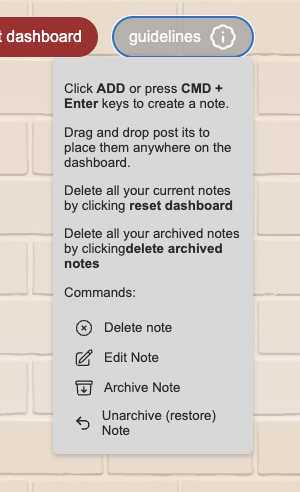

# Virtual Post-its

## Link to the live application: [TBC](https://XXX/) !

### Virtual Sticky Notes App

A desktop web application that recreates the experience of using real sticky notes, enhanced by an intuitive drag-and-drop interface.

Stay organized and manage your daily tasks, reminders, and ideas effortlessly with a colorful and interactive virtual wall.

⭐ Features

- ✅ Create and edit notes
- ✅ Delete individual or all current notes
- ✅ Archive and unarchive notes
- ✅ Delete all current notes
- ✅ Delete all archived notes
- ✅ Drag and drop notes to reposition them freely
- ✅ Confirmation prompts for delete actions
- ✅ Success messages for key actions
- ✅ Keyboard shortcuts for quick saving and note creation
- ✅ Saves notes and their positions persistently using local storage

## ⚙️ Tech Stack

- ReactJS
- JavaScript
- Vite
- Lucide-React icons
- React-toastify
- Vercel (deployment)

### ➕ Bonus features to add later:

- Error handling
- Back-end integration :
  - User authentication
  - Storage of the data
- Export to PDF or Print option
- Share functionality to send notes to others

## 📸 Screenshots

### \_\_\_Main page

### \_\_\_ Post-it edit mode

### \_\_\_ Archived drawer

### \_\_\_ Guidelines

